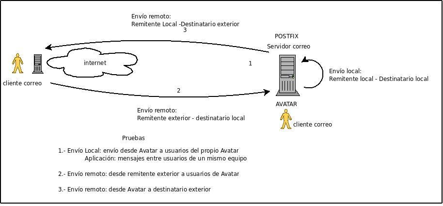

## Figura:

  

  
## Análisis de casos

En la documentación entregada en pdf, se explica cómo montar un servidor de correo en Avatar, prácticas que se corresponden con los **casos 1, 2 y 3** de la figura. Revisaremos los pasos a seguir, haciendo algunos matices:

* **Caso 1**: enviar correo desde Avatar a usuarios del propio servidor. Esta situación podemos aprovecharla para el envío de correos entre usuarios de la máquina, disponiendo de correo interno. Con utilidades como `mail usuario` podemos enviar mensajes a usuarios del propio sistema. Genial. Usa el fichero pdf para ver un ejemplo.
* **Caso 2**: enviar correo desde un cliente en Internet a usuarios del propio servidor. En este caso, debemos aplicar una regla DNAT en nuestro router para redirigir las peticiones SMTP a Avatar, de igual forma que hicimos para montar el servidor web, con la diferencia que el puerto a reenviar es el 25.
    * Cliente: enviamos un correo desde una cuenta de gmail a una cuenta de Avatar (obsérvese que la cuenta del usuario de Avatar (alumno) tiene el dominio `doesntexist.org` y no el indicado en el pdf `dynalias.com`). **Observación importante**: para operar con la cuenta `alumno@avatar.doesntexist.org` debe crear la cuenta en Avatar (`adduser alumno`)  
    
        

    * Servidor Avatar: lista de mensajes recibidos.

        

  
  

* **Caso 3**: desde Avatar enviamos correo a usuarios en Internet. Hacemos el proceso inverso al caso 2.

    * Cliente:

        

    * Servidor remoto: al tener el servidor una IP dinámica, el servidor de correo gmail bloquea las peticiones de envío (compruébalo en el fichero de log con `less /var/log/mail.log`). No obstante puede que os funcionen los primeros envíos.

          

"