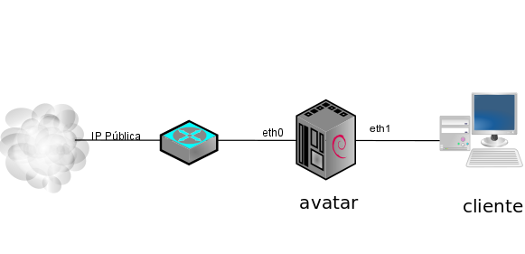
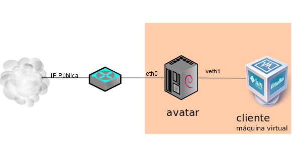
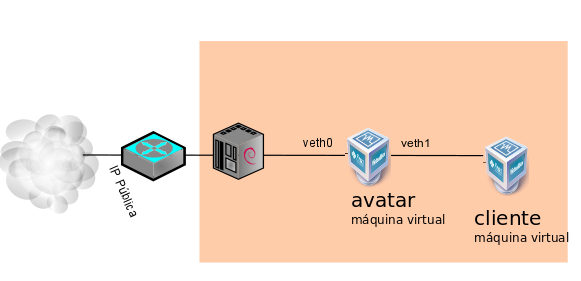

Ya conocemos el esquema de red que vamos a implementar: un servidor (avatar) conectado a Internet por eth0, los clientes de nuestra red estarán conectados al servidor mediante la otra interfaz de red, eth1. El servidor se irá configurando y administrando para ofrecer distintos servicios a los clientes internos y externos.  
  
En este apartado vamos a responder a la siguiente pregunta: ¿qué alternativas podemos utilizar en este curso para simular el funcionamiento del esquema de red anteriormente explicado? Tenemos tres alternativas:  
  
1. Utilizar como servidor un ordenador con dos tarjetas de red  
  
    Es la opción que nosotros recomendamos encarecidamente y en la que se van a basar los contenidos del curso. En este caso las dos interfaces de red corresponderán a dos tarjetas físicas de red. Podéis utilizar como servidor cualquier equipo antiguo que tengáis en casa o en el centro y en el que podáis poner dos interfaces de red, con un Pentium III y 256 MB de RAM sería más que suficiente.  

      

    * La tarjeta de red correspondiente a la interfaz eth0 estará conectada a Internet y tendrá una dirección privada o pública dependiendo de la conexión que tengáis en casa.
    * Para simular un cliente necesitamos otro ordenador que estará conectado a la interfaz eth1 de avatar mediante un switch o mediante un cable cruzado. Podéis utilizar vuestro equipo habitual e incluso la conexión entre avatar y el cliente podría ser inalámbrica. En el tema 9 es necesario que el cliente sea un equipo con Debian GNU/Linux, por lo que los que hagáis el curso intermedio deberéis hacer sitio en el equipo cliente para una partición con este sistema, para el resto de temas es indiferente el sistema operativo del cliente.  

2. Utilizar como servidor un ordenador con una tarjeta de red y una máquina virtual como cliente  
  
    La única dificultad de la opción anterior es disponer de un ordenador con dos tarjetas y otro ordenador que simule el cliente. En el caso de que sólo dispongamos de un equipo, podemos simular el cliente con un máquina virtual conectado a la máquina real mediante una interfaz virtual que llamaremos veth1. Como no es objeto de estudio de este curso la virtualización se deja a vuestro criterio el software de virtualización a utilizar (Kvm, Xen, VirtualBox, VMWare, ...).  

      

    * Del mismo modo que en el caso anterior eth0, correspondiente a la tarjeta de red, estará conectada a Internet.
    * La máquina virtual simulará al cliente y estará conectada al servidor mediante una interfaz de red virtual veth1, no serán válidas conexiones virtuales tipo bridge, que pondrían la máquina virtual en la misma red que la interfaz eth0 de avatar.
  
3. Utilizar dos máquinas virtuales  
  
    En caso de que no fuera posible instalar un sistema operativo nuevo en nuestro ordenador, existe la posibilidad de simular toda la red completa mediante máquinas virtuales, avatar en este caso tendrá dos interfaces de red virtuales: veth0 y veth1. y tendremos otra máquina virtual que utilizaremos como cliente y cuya interfaz de red estará conecta a la misma red que el veth1 del servidor. (NO ESTÁ BIEN EL DIBUJO)  
  

      

    * La máquina virtual que haga de servidor tendrá una interfaz de red veth0 conecta a la máquina real y será la que nos de acceso a internet.
    * La máquina virtual cliente estará conectada al segmento de red conectado a la interfaz veth1 del servidor.

  
**IMPORTANTE**: Nosotros recomendamos que utilicéis la primera alternativa, que es la forma más real de simular el esquema seleccionado y os recomendamos utilizar alguna de las otras dos sólo si os desenvolvéis con soltura con las máquinas virtuales. Todo el contenido del curso se basará en la primera opción, pero no es difícil hacer el paralelismo a cualquiera de las tres alternativas."