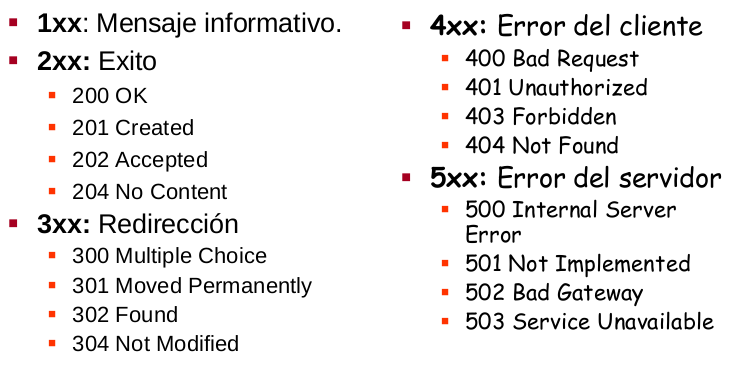

* [Presentación de la unidad](u1.pdf)

## Descripción general

Protocolo de comunicaciones estándar que comunica servidores, proxys y clientes. Permite la transferencia de documentos web, sin importar cual es el cliente o cual es el servidor.

Es un protocolo basado en el esquema petición/respuesta. El cliente realiza una petición y el servido devuelve una respuesta.

El protocolo HTTP está basado en mensajes de texto plano y es un protocolo sin manejo de estados.

## Funcionamiento del protocolo

El usuario escribe una URL, indicando el protocolo, servidor y recurso que quiere obtener, el servidor procesa dicha información y devuelve un mensaje de respuesta, normalmente con el HTML de la página que se va a visualizar,...

El contenido del mensaje según sea la petición o la respuesta lo podemos ver en el siguiente esquema:

## Métodos de envío de los datos

Cuando se realiza una petición se puede utilizar uno de los siguientes métodos:

* GET: Solicita un documento al servidor. Se pueden enviar datos en la URL.
* HEAD: Similar a GET, pero sólo pide las cabeceras HTTP.
* POST: Manda datos al servidor para su procesado.Similar a GET, pero además envía datos en el cuerpo del mensaje.
* PUT: Almacena el documento enviado en el cuerpo del mensaje.
* DELETE: Elimina el documento referenciado en la URL.
* ...

## Código de estados

Cuando el servidor devuelve una respuesta se indica un código de estado:

## Cabeceras

Tanto la petición como las respuestas tienen una serie de metainformación llamadas cabeceras, podemos indicar las más importantes:

* `Host`: Nombre y puerto del servidor al que se dirige la petición.
* `User-Agent`: Identificación del programa del cliente.
* `Server`: indica el tipo de servidor HTTP empleado.
* `Cache-control`: lo usa el servidor para decirle al navegador que objetos cachear, durante cuanto tiempo, etc..,
* `Content-type`: Tipo MIME del recurso.
* `Content-Encoding`: se indica el tipo de codificación empleado en la respuesta.
* `Expires`: indica una fecha y hora a partir del cual la respuesta HTTP se considera obsoleta. Usado para gestionar caché.
* `Location`: usado para especificar una nueva ubicación en casos de redirecciones.
* `Set-Cookie`: Solicita la creación de una cookie en el cliente.

## Otras características

* **Cookies**: Las cookies son información que el navegador guarda en memoria o en el disco duro dentro de ficheros de texto, a solicitud del servidor.
* **Sesiones**: HTTP es un protocolo sin manejo de estados. Las sesiones nos permiten definir estados, para ello el servidor almacenará la información necesaria para llevar el seguimiento de la sesión.
* **Autentificación**: A veces, debido a cuestiones de personalización o a políticas de restricción, las aplicaciones Web deben conocer y verificar la identidad del usuario, mediante nombre de usuario y contraseña.
* **Conexiones persistentes**: Permiten que varias peticiones y respuestas sean transferidas usando la misma conexión TCP.

## Ejemplo de peticiones

	GET -USE http://playerone.josedomingo.org/index.php
	GET -USE http://playerone.josedomingo.org/index.php?variable=100
	POST -aUSE http://playerone.josedomingo.org/index.php
