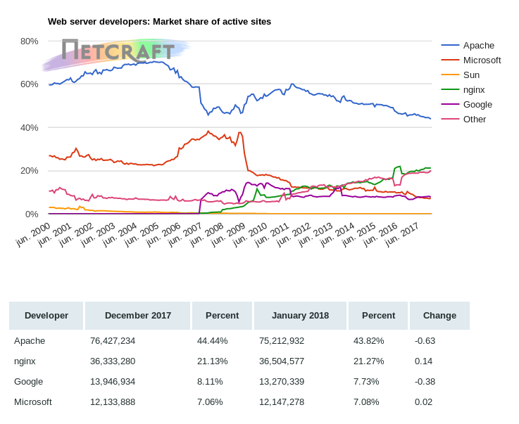

* [Presentación de la unidad](u2.pdf)

## Conceptos básicos

* Servidor web HTTP de código abierto
* Plataformas Linux, Windows, Mac y otras
* Implementa el protocolo HTTP/1.1
* Se desarrolla dentro del proyecto HTTP Server (httpd) de la Apache Software Fundation
* Apache es el servidor HTTP más usado
* Extremadamente estable

## Un poco de historia

* El proyecto surge del Centro Nacional de Actividades de Supercomputación (*National Center for Supercomputing Activities, NCSA*) de la Universidad de Illinois.
* Se creó un servidor llamado **HTTPd NCSA**, el más utilizado hasta 1994.
* Su principal desarrollador, Rob McCool, abandonó el NCSA y el proyecto.
* A partir de entonces varios programadores empiezan a desarrollar "parches" para el servidor.
* El nombre proviene de la tribu Apache (connotación de algo que es firme y enérgico pero no agresivo).
* También en inglés suena igual que *servidor parcheado* (**a patchy server**).
* La primera versión que aparece de Apache es la 0.6 en Abril de 1995.
* Apache tiene amplia aceptación en la red: desde 1996, Apache, es el servidor HTTP más usado.
* El servidor Apache es desarrollado y mantenido por una comunidad de usuarios bajo la supervisión de la *Apache Software Foundation* dentro del proyecto *HTTP Server* (httpd).
* Actualmente usamos la versión 2.4, y está en desarrollo la 2.5.

## Uso de servidores web

Estadística de Netcraft de enero de 2018:

## Ventajas de usar Apache2

* Modular
* Código abierto
* Multi-plataforma
* Extensible
* Popular (fácil conseguir ayuda/soporte)
