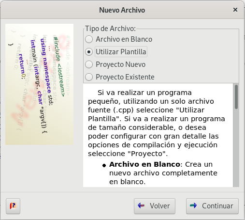
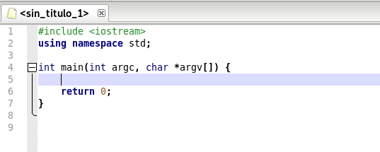
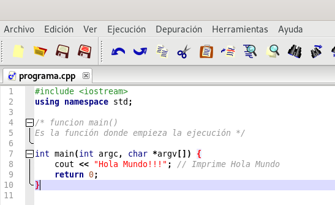
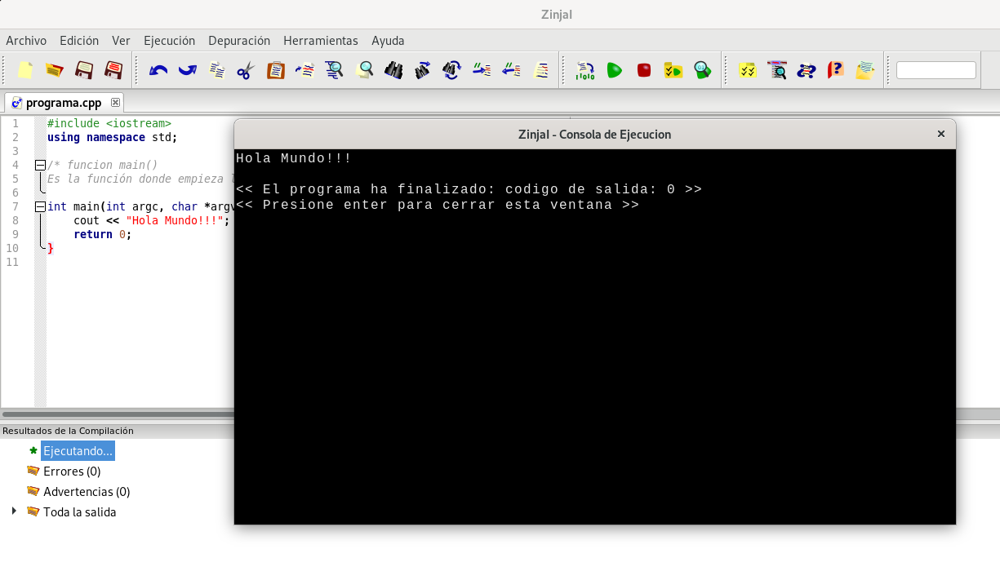
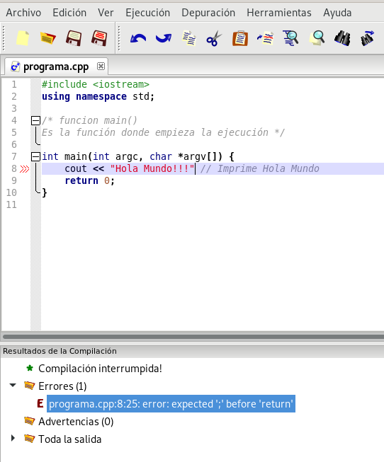

Vamos a compilar y ejecutar nuestro primer programa en C++:

    #include <iostream>
    using namespace std;

    /* funcion main() 
    Es la función donde empieza la ejecución */
    
    int main(int argc, char *argv[]) {
       cout << "Hola Mundo!!!"; // Imprime Hola Mundo
       return 0;
    }

Para ello vamos a seguir los siguientes pasos:

* **Paso 1**: Lo primero que debe hacer, es crear un nuevo programa. Para ello seleccione la opción `Nuevo...` del menú `Archivo` (o pulsando `CTRL + N`).

    Se desplegará inmediatamente el Asistente para Nuevo Archivo. Allí seleccione la opción `Utilizar Plantilla` y haga click en el botón `Continuar`:

    

    A continuación elegimos la versión de C++ que vamos a usar, por ejemplo `Programa C++14 en blanco` y obtendremos un fichero con la estructura de nuestro programa:

    

* **Paso 2**: Escribimos el programa en el editor. Recuerda que el programa se puede guardar (Opción `Archivo` -> `Guardar` o `CTRL + S`) en un fichero en nuestro sistema de archivos con la extensión `cpp`.

    

* **Paso 3**: Para intentar ejecutar el programa presione `F9`, o seleccione la   opción `Ejecutar` del menú `Ejecutar`.

    Esta acción guarda el archivo (si aún no tiene nombre la hará en un directorio temporal), lo compila, y si la compilación es exitosa lo ejecuta. Aparecerá en la parte inferior de la ventana principal el **Panel de Resultados del Compilador**, en el cual se muestra el estado de la compilación y los resultados de la misma.

    Si la compilación no tiene errores se ejecuta el programa y aparece una ventana de terminal donde vemos la ejecución.  Luego de finalizar la ejecución,ZinjaI  informará el código de retorno de su programa (el 0 de la línea final `return 0;`, el cual sirve para saber si se ejecutó correctamente) y esperará aque presione  `enter`  una vez más antes de cerrar la ventana, para permitirle observar los resultados. 

    

    Sin embargo si hemos tenido algún error pasamos al siguiente paso.

* **Paso 4**: Si hemos cometido algún error, por ejemplo se nos ha olvidado un `;` al final de una instrucción, en el proceso de compilación obtendremos errores:

    Al hacer doble click sobre el error en el panel de compilación el cursor se desplaza hacia la linea que lo provocó.

    

    Por lo tanto tenemos que corregir todos los errores sintácticos para que el proceso de compilación no nos de ningún error y se pueda ejecutar el programa.

## Atajos de teclado

A continuación se listan algunas combinaciones de teclas para aprovechar mejor algunas facilidades de edición ZinjaI:

* `F9`: Este atajo realiza todos los pasos necesarios para probar un programa (guardar, compilar y ejecutar). Si se presiona `Shift+F9`, se evita el último paso; es decir, sólo se compila. Esto sirve para saber si el código es sintácticamente correcto.
* `Ctrl+<`: Si la compilación arroja errores o advertencias, con esta combinación se pueden recorrer los mismos. 
* `Ctrl+H`:  Esta combinación busca la librería que contiene la declaración de una determinada clase, función, variable o macro e inserta al principio del archivo el #include que corresponda para poder utilizarla.
* `Ctrl+L, Ctrl+Shift+L`: La primera duplica la linea actual o las líneas seleccionadas. Es útil en muchos casos en que el código incluye líneas casi idénticas, equivale a copiar y pegar esas líneas. La segunda combinación elimina la línea actual o las líneas seleccionadas. 
* `Ctrl+T, Ctrl+Shift+T`: estas combinaciones desplazan la línea actual o las líneas seleccionadas una posición más arriba en el código. Sirven para mover fragmentos de código lineas arriba o abajo.

