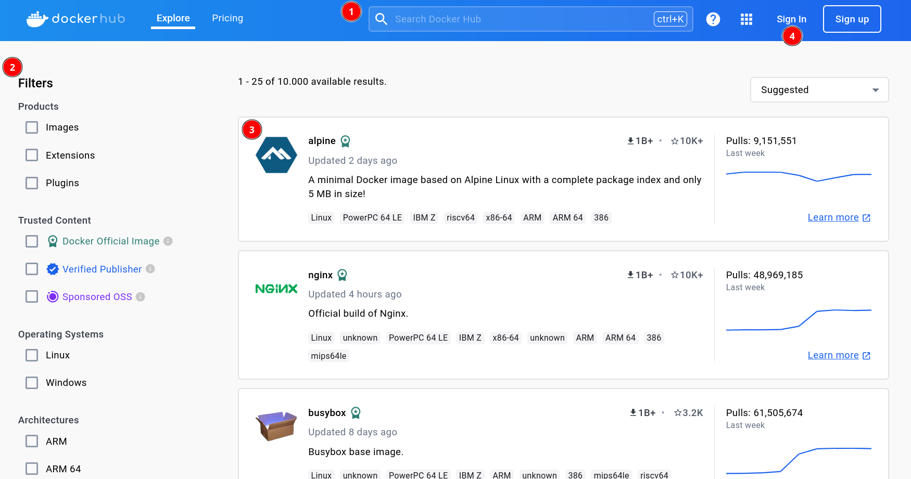
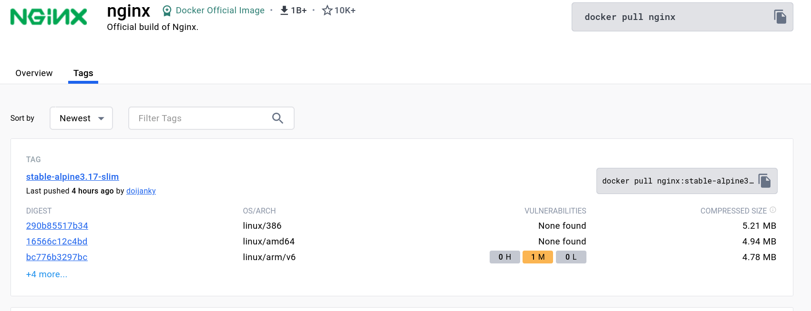

## Docker Hub

[**Docker Hub**](https://hub.docker.com/) es un registro público de imágenes Docker.

## Conceptos de Docker Hub

* **Repositorio**: Un repositorio nos permite guardar una imagen. De cada imagen podemos tener distintas versiones. Las **etiquetas** nos permiten identificar cada versión.
* **Usuarios**: Nos podemos dar de alta en **Docker Hub** para subir y distribuir nuestras imágenes.
* El nombre de una imagen tiene el siguiente formato: **usuario/nombre:etiqueta**.
* Las imágenes oficiales en Docker Hub no tienen nombre de usuario.

## Tipos de imágenes

Podemos tener varios tipos de imágenes, según lo que nos ofrece:

* Imágenes que nos ofrecen una **distribución completa de un sistema operativo** (Ubuntu, CentOs, Debian, Fedora, Alpine,...). La distribución **alpine** nos ofrece un sistema operativo que sólo incluyen los elementos esenciales necesarios para ejecutar una aplicación, por este motivo ocupa muy poco espacio, por lo tanto sus imágenes son muy pequeñas. Además, nos podemos encontrar imágenes de este tipo con la etiqueta **slim**, en este caso serán imágenes más livianas.
    * Ejemplo: **debian:bookworm**, **debian:bookworm-slim**, **ubuntu:22.04**, **alpine:3**.
* Imágenes que nos ofrecen distintos **servicios** (servidor web, servidor de base de datos,...). En este caso las etiquetas suelen indicar la versión y el sistema operativo base que ofrece el servicio.
    * Ejemplo: **http:2.4-bookworm**, **http:2.4-alpine**, **mariadb:11.2-jammy**, **mariadb:10.6-focal**.
* Imágenes que ofrecen **lenguajes de programación** (PHP, Python, Java, NodeJS,...). En este caso la etiqueta nos puede indicar la versión, el sistema operativo base que se utiliza, el servicio que se está ofreciendo.
    * Ejemplo: **php:bookworm**, **php:fpm-bookworm**, **python:3.12-slim-bookworm**, **openjdk:23-ea-6-jdk-bookworm**.
* Imágenes que ofrecen un CMS completo (WordPress, NextCloud, Drupal,...). Como en el caso anterior, las etiquetas nos informan de la versión, del sistema operativo, del servicio ofrecido,...
    * Ejemplos: **wordpress:6.4.2-php8.1-apache**, **wordpress:6.4.2-php8.1-fpm**, **wordpress:6.4.2-fpm-alpine**.

## Contenido de confianza

* **Imágenes oficiales Docker**: Son mantenidas y distribuidas directamente por Docker, Inc. Son confiables, bien mantenidas y son una opción segura para utilizar en entornos de producción.

* **Editor verificado Docker**: Las imágenes que tienen este logotipo, son proporcionadas por usuarios verificados por Docker. Estas imágenes se caracterizan por su actualización continúa para evitar problemas de seguridad.

* **Imágenes de código abierto patrocinadas por Docker**: Estas imágenes son publicadas y mantenidas por proyectos de código abierto patrocinados por Docker.

## Introducción a la interfaz web de Docker Hub

Podemos acceder al registro público de imágenes Docker **Docker Hub** en el enlace: [https://hub.docker.com](https://hub.docker.com).

Podemos observar varios elementos:

1. Un formulario de búsqueda, que nos permite buscar imágenes por palabras.
2. Si tenemos muchos resultados tenemos la opción de filtrar la búsqueda por tipo de producto, contenido de confianza, sistema operativo y arquitectura.
3. Al hacer la búsqueda obtenemos una lista de **repositorios**. Cada repositorio puede almacenar distintas versiones de una misma imagen.
4. Podemos darnos de alta en Docker Hub, para gestionar nuestras propias imágenes. 

Si accedemos a un repositorio, visualizaremos la documentación de la imagen (pestaña **Overview**). Iremos estudiando detenidamente la documentación de varias imágenes, pero los apartados más comunes que nos encontramos son los siguientes:

* Descripción de la aplicación o servicio ofrecido por la imagen.
* Etiquetas con las que podemos trabajar en esta imagen.
* Ejemplos de cómo crear contenedores a partir de esta imagen.
* Variables de entorno que puedo crear en la creación para configurar el servicio o la aplicación.
* Directorios que debo guardar para hacer el contenedor persistente.
* Ejemplos de ficheros de Docker Compose para gestionar el ciclo de vida de la aplicación.

En la pestaña **Tags** obtenemos una lista de todas las versiones de la imagen para cada uno de los sistemas operativos y arquitecturas.

