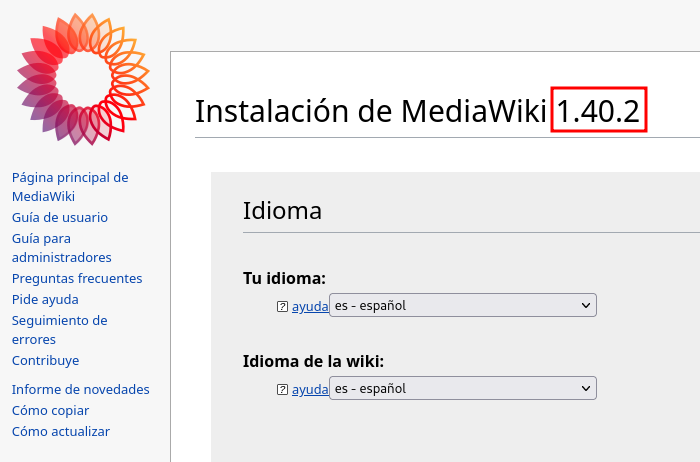
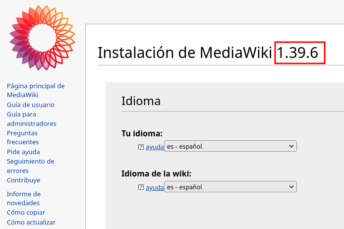

# Ejemplo: Desplegando la aplicación MediaWiki

[**MediaWiki**](https://www.mediawiki.org/wiki/MediaWiki/es) es una aplicación web escrita en PHP que nos permite elaborar una wiki. En este ejemplo vamos a crear contenedores usando la imagen [`mediawiki`](https://hub.docker.com/_/mediawiki) que encontramos en Docker Hub. 

## Instalación de distintas versiones de la MediaWiki

Vamos a crear distintos contenedores usando etiquetas distintas al indicar el nombre de la imagen, posteriormente accederemos a la aplicación y podremos ver la versión instalada.

En primer lugar vamos a instalar la última versión:

```bash
docker run -d -p 8080:80 --name mediawiki1 mediawiki
```

Si accedemos a la dirección IP de nuestro ordenador, al puerto 8080/tcp, podemos observar que hemos instalado la versión 1.41.0:


A continuación vamos a instalar otra versión de la MediaWiki, la 1.40.2, creamos otro contenedor con otro nombre y mapeamos otro puerto:

```bash
docker run -d -p 8081:80 --name mediawiki2 mediawiki:1.40.2
```

Si accedemos a la dirección IP de nuestro ordenador, al puerto 8081/tcp, podemos observar que hemos instalado la versión 1.40.2:



Y finalmente vamos a instalar otra versión en otro contenedor:

```bash
docker run -d -p 8082:80 --name mediawiki3 mediawiki:1.39.6
```

Si accedemos a la dirección IP de nuestro ordenador, al puerto 8082/tcp, podemos observar que hemos instalado la versión 1.39.6:



**Nota: Puedes observar que la primera imagen que se baja, descarga todas las capas, sin embargo al descargar las otras versiones de la imagen, sólo se bajan las capas que difieren de la primera imagen descargada.**