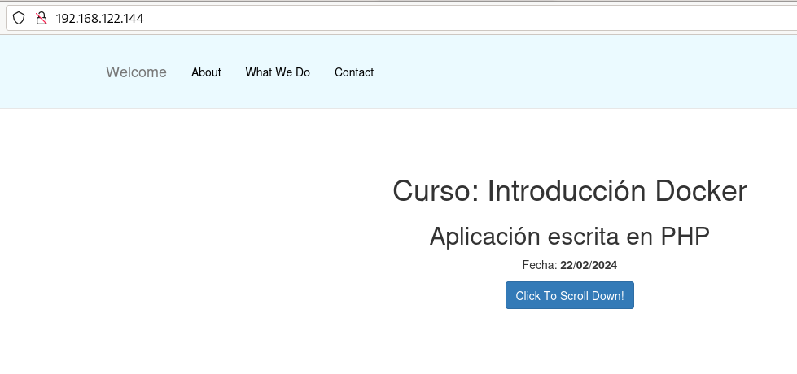
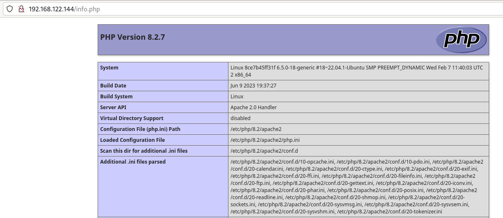

# Ejemplo 2: Construcción de imágenes con una una aplicación PHP

En este ejemplo vamos a crear una imagen Docker con una página desarrollada con PHP. 
Puedes encontrar los ficheros necesarios en el [Repositorio con el código de los ejemplos](https://github.com/josedom24/ejemplos_curso_docker_ow).

## Versión 1: Desde una imagen base

En el contexto vamos a tener el fichero `Dockerfile` y un directorio, llamado `app`, con nuestra aplicación.

En este caso vamos a usar una imagen base de un sistema operativo sin ningún servicio. El fichero `Dockerfile` será el siguiente:

```Dockerfile
# syntax=docker/dockerfile:1
FROM debian:stable-slim
RUN apt-get update && apt-get install -y apache2 libapache2-mod-php php && apt-get clean && rm -rf /var/lib/apt/lists/*
COPY app /var/www/html/
RUN rm /var/www/html/index.html
EXPOSE 80
CMD apache2ctl -D FOREGROUND
```

* Al usar una imagen base `debian:stable-slim` tenemos que instalar los paquetes necesarios para tener el servidor web, PHP y las librerías necesarias. 
* A continuación añadiremos el contenido del directorio `app` al directorio `/var/www/html/` del contenedor. 
* Hemos borrado el fichero `/var/www/html/index.html` para que no sea el fichero que se muestre por defecto.
* Finalmente indicamos el comando que se deberá ejecutar al crear un contenedor a partir de esta imagen: iniciamos el servidor web en segundo plano.

Para crear la imagen ejecutamos:

```bash
$ docker build -t josedom24/ejemplo2:v1 .
```

Comprobamos que la imagen se ha creado:

```bash
$ docker images
REPOSITORY             TAG                 IMAGE ID            CREATED             SIZE
josedom24/ejemplo2     v1                  8c3275799063        1 minute ago      226MB
```

Y podemos crear un contenedor:

```bash
$ docker run -d -p 80:80 --name ejemplo2 josedom24/ejemplo2:v1
```

Y acceder con el navegador a nuestra página:



La aplicación tiene un fichero `info.php` que me da información sobre PHP, en este caso observamos que estamos usando la versión 8.2:




## Versión 2: Desde una imagen con PHP instalado

En este caso el fichero `Dockerfile` sería el siguiente:

```Dockerfile
# syntax=docker/dockerfile:1
FROM php:7.4-apache
COPY app /var/www/html/
EXPOSE 80
```

* En este caso no necesitamos instalar nada, ya que la imagen tiene instalado el servidor web y PHP. 
* No es necesario indicar el `CMD` ya que por defecto el contenedor creado a partir de esta imagen ejecutará el mismo proceso que la imagen base, es decir, la ejecución del servidor web.

De forma similar, crearíamos una imagen y un contenedor:

```bash
$ docker build -t josedom24/ejemplo2:v2 .
$ docker run -d -p 80:80 --name ejemplo2 josedom24/ejemplo2:v2
```

Podemos acceder al fichero `info.php` para comprobar la versión de PHP que estamos utilizando con esta imagen:

