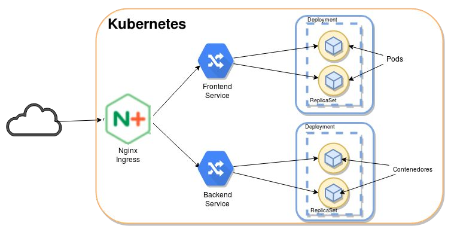

Kubernetes es un orquestador de contenedores de aplicación escrito en Go y con licencia Apache-2.0, fue lanzado el 21 de julio de 2015 por Google que rápidamente se alió con la Linux Foundation para crear la Cloud Native Computing Foundation (CNCF) y dejó el proyecto en sus manos.

Gestionamos un cluster:

    kubectl get nodes
    NAME     STATUS   ROLES    AGE     VERSION
    nodo-1   Ready    master   2m32s   v1.12.2
    nodo-2   Ready    <none>   42s     v1.12.2
    nodo-3   Ready    <none>   42s     v1.12.2

## Recursos de Kubernetes

* **Pods**: La unidad mínima de computación, permite ejecutar contenedores. Representa un conjunto de contenedores y almacenamiento compartido que comparte una única IP.
* **ReplicaSet**: Asegura que siempre se ejecute un número de réplicas de un pod determinado. Nos proporciona las siguientes características:
    * Que no haya caída del servicio
    * Tolerancia a errores
    * Escalabilidad dinámica
* **Deployment**: Nos permite manejar los ReplicaSets. Nos proporciona las siguientes características:
    * Actualizaciones continuas
    * Despliegues automáticos
* **Service**: Nos permite el acceso a los pod.
* **Ingress**: Nos permite implementar un proxy inverso para el acceso a los distintos servicios establecidos. Estos dos elementos nos proporcionan la siguiente funcionalidad:
    * Balanceo de carga

