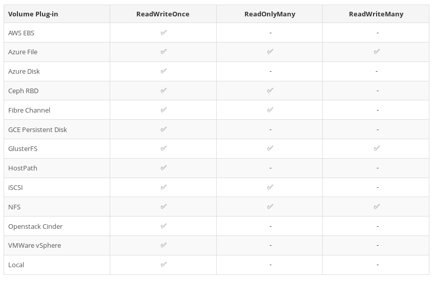

En este ejemplo vamos a utilizar un volumen (almacenamiento persistente) para guardar las bases de datos de la aplicación (que están guardadas en el directorio `/cms/data`). Vamos a continuar trabajando donde lo dejamos en la unidad anterior.

## Estrategia de despliegue

En este momento tenemos instalado phpSQLiteCMS pero sin almacenamiento persistente. Para trabajar con almacenamiento persistente en el próximo paso vamos a crear un volumen, pero antes vamos a cambiar la estrategia de despliegue de la aplicación:

* Por defecto la estrategia es **Rolling**: En este caso se crean los nuevos pods de la nueva versión del despliegue se comprueban que funcionan y posteriormente se eliminan los pods de la versión anterior.
* Nosotros deseamos que la estrategia sea **Recreate**: En esta situación se eliminan los pods de la versión actual y posteriormente se crean los nuevos pods de la nueva versión. Si vamos a trabajar con volúmenes, necesitamos configurar este tipo de estrategia, ya que la primera nos da errores al intentar conectar el volumen a un nuevo pod cuando sigue conectado al anterior pod.

Para cambiar la estrategia: Elegimos el despliegue de *appphp* y en el botón **Actions** elegimos la opción **Edit**:

## Creación del volumen

A continuación vamos a crear un nuevo volumen:

Al crear el volumen tenemos que elegir entre varios medio de almacenamiento (**Storage Class**). Las posibilidades de medios de almacenamiento dependerán de la infraestructura donde está instalado OpenShift. Como medios de almacenamiento podemos tener: NFS, HostPath, GlusterFS, Ceph RBD, OpenStack Cinder, AWS Elastic Block Store (EBS), GCE Persistent Disk, iSCSI, Fibre Channel,...

 OpenShiftOnline está instalado en AWS por lo que tenemos dos medios de almacenamiento: **ebs**: Elastic Block Store que proporciona volúmenes de almacenamiento, y *gp2-encrypted*, similar al anterior pero la información está cifrada.

Dependiendo del medio de almacenamiento que tenga nuestra infraestructura tendremos distintas formas de acceso a la información guardada en el volumen:
* ReadWriteOnce: lectura y escritura solo para un nodo (RWO)
* ReadOnlyMany: sólo lectura para muchos nodos (ROX)
* ReadWriteMany: lectura y escritura para muchos nodos (RWX)

Por ejemplo los volúmenes de tipo **ebs** no soportan el modo *ReadWriteMany*, por consecuencia, si tenemos un despliegue al que hemos conectado un volumen con tipo de acceso *ReadWriteOnce*, este despliegue no podrá replicarse, es decir no podemos tener varios pods replicados ya que no podríamos montar el volumen al mismo tiempo en los distintos pods.

En la siguiente tabla podemos ver la relación entre los medios de almacenamiento y los tipos de acceso que soportan:

## Añadir el volumen a un despliegue

El volumen que hemos creado lo conectamos al despliegue *appphp* en el directorio `/opt/app-root/src/cms/data`: Elegimos el despliegue de *appphp* y en el botón **Actions** elegimos la opción **Add Storage**:

En el momento que hemos añadido el almacenamiento a nuestra aplicación se produce un nuevo despliegue de forma automática que implantará la aplicación con el volumen persistente.

En el directorio `cms/data` de phpSQLiteCMS se guardan las bases de datos sqltile de la aplicación. Por lo tanto es el directorio que necesitamos que este guardado en un volumen persistente.

Pero al montar el volumen en el directorio indicado, hemos perdido su contenido, y al acceder a la aplicación nos da un error:

Para solucionarlo vamos a copiar las bases de datos desde nuestro ordenador:

* He clonado el repositorio de *phpsqlitecms*  en mi ordenador:

        $ git clone https://github.com/ilosuna/phpsqlitecms.git
        $ cd phpsqlitecms/cms

* Vamos a copiar el contenido de este directorio al volumen, para ello:

        $ oc get pods
        NAME             READY     STATUS      RESTARTS   AGE
        appphp-1-build   0/1       Completed   0          12m
        appphp-2-tj5jm   1/1       Running     0          1m

        $ oc cp data appphp-2-tj5jm:cms/

* Comprobamos que hemos copiado los ficheros:

        $ oc exec appphp-2-tj5jm ls cms/data
        content.sqlite
        entries.sqlite
        userdata.sqlite
  
Podemos concluir que cada vez que hagamos un nuevo despliegue se creara de nuevo el sistema de fichero de los contenedores, a excepción del directorio `cms/data` cuya información esta guardada en el volumen. 

Ya podemos acceder a nuestra aplicación. Para terminar el ejercicio podemos comprobar que las modificaciones que hacemos en la configuración de la página se mantienen cuando se borran los pods, por ejemplo al crear un nuevo despliegue.

