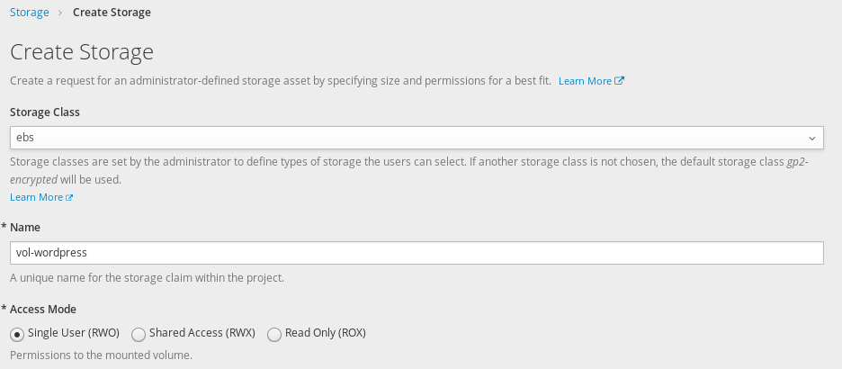
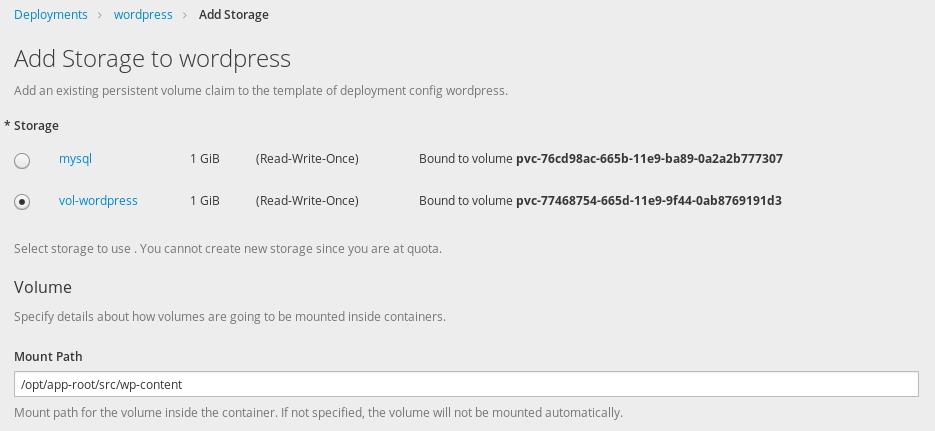
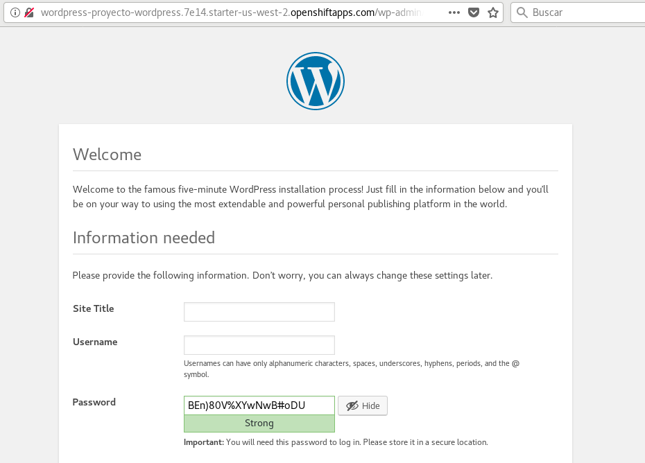

---
title: "Despliegue de Wordpress en OpenShift"
permalink: /cursos/openshift/curso/u26/index.html
--- 

En esta unidad vamos a instalar WordPress, un CMS escrito en PHP, en OpenShift aplicando todos los conocimientos que hemos estudiado en unidades anteriores:

## Creación de la base de datos

Vamos a crear un nuevo proyecto y en ella vamos a crear una aplicación con la base de datos mysql. Para ellos escogemos en el catálogo la imagen de mysql e indicamos las variables para su creación:

## Despliegue de WordPress

A continuación vamos a crear una aplicación PHP con el despliegue de WordPress para ello vamos a utilizar el repositorio oficial de la aplicación: `https://github.com/WordPress/WordPress`:

A continuación, antes de trabajar con el volumen, y como explicábamos en unidades anteriores vamos a cambiar la estrategia de despliegue, para ello elegimos el despliegue de *wordpress* y en el botón **Actions** elegimos la opción **Edit**:

## Creación del volumen

A continuación vamos a crear un nuevo volumen:

Y lo conectamos al despliegue *wordpress* en el directorio `/opt/app-root/src/wp-content`: Elegimos el despliegue de *wordpress* y en el botón **Actions** elegimos la opción **Add Storage**:

En el momento que hemos añadido el almacenamiento a nuestra aplicación se produce un nuevo despliegue de forma automática que implantará la aplicación con el volumen persistente.

En el directorio `wp-content` de WordPress se guardada todos los datos de la aplicación (documentos que subimos, plugins, temas,...). Por lo tanto es el directorio que necesitamos que este guardado en un volumen persistente.

Pero al montar el volumen en el directorio indicado, hemos perdido su contenido, por lo que vamos a copiarlo desde nuestro ordenador:

* He clonado el repositorio de WordPress en mi ordenador:

        $ git clone https://github.com/WordPress/WordPress
        $ cd WordPress

* Vamos a copiar el contenido de este directorio al volumen, para ello:

        $ oc get pods
        NAME                READY     STATUS      RESTARTS   AGE
        mysql-1-r9vjk       1/1       Running     0          22m
        wordpress-1-build   0/1       Completed   0          20m
        wordpress-2-dsgnr   1/1       Running     0          2m

        $ oc cp wp-content wordpress-2-dsgnr:/opt/app-root/src/

* Comprobamos que hemos copiado los ficheros:

        $ oc exec wordpress-2-dsgnr ls wp-content
        index.php
        plugins
        themes

Podemos concluir que cada vez que hagamos un nuevo despliegue se creara de nuevo el sistema de fichero de los contenedores, a excepción del directorio `wp-content` cuya información esta guardada en el volumen. Seguimos teniendo un problema: el fichero `wp-config.php` donde se guarda la configuración de WordPress se perderá cada vez que hacemos un despliegue. Para solucionarlo, vamos a copiar al volumen persistente dos ficheros:

1. Un fichero `wp-config.php` con la configuración de wordpress con los datos para el acceso a la base de datos:

        $ cd ficheros
        $ oc cp wp-config.php wordpress-2-dsgnr:/opt/app-root/src/wp-content

2. Un fichero `run.sh` que vamos a ejecutar cada vez que hagamos un nuevo despliegue y va a crear un enlace simbólico al fichero de configuración que tenemos guardado: 

        $ oc cp run.sh wordpress-2-dsgnr:/opt/app-root/src/wp-content
    
    El contenido del fichero `run.sh` es:

        #!/bin/bash
        ln -s /opt/app-root/src/wp-content/wp-config.php /opt/app-root/src/wp-config.php
        exec /usr/libexec/s2i/run
    
    Y tenemos que darle permiso de ejecución:

        $ oc exec wordpress-2-dsgnr chmod +x wp-content/run.sh

## Ejecutando un comando en el despliegue

Como hemos indicado anteriormente cada vez que hagamos un despliegue tenemos que ejecutar el script anterior para que se cree el enlace directo al fichero `wp-config.php`, para ello elegimos el despliegue de *wordpress* y en el botón **Actions** elegimos la opción **Edit YAML** y vamos a añadir la sección `command`:

    spec:
      containers:
        - image: >-
            172.30.254.23:5000/proyecto-wordpress/wordpress@sha256:7458214fb3da2a6deec8fa13dbdf8af42b09a75e98735937bf67f6da72adb468
          imagePullPolicy: Always
          name: wordpress
          command:
            - /opt/app-root/src/wp-content/run.sh
    ...

En el momento que hemos modificado la configuración a nuestra aplicación se produce un nuevo despliegue de forma automática que implantará la modificación indicada.

## Despliegue de WordPress

Para concluir accedemos a la URL de nuestra aplicación y terminamos de configurar la instalación de WordPress (como podemos observar se ha saltado el paso donde nos preguntan por las credenciales de la base de datos, ya que hemos indicado un fichero `wp-config.php` con la configuración).

