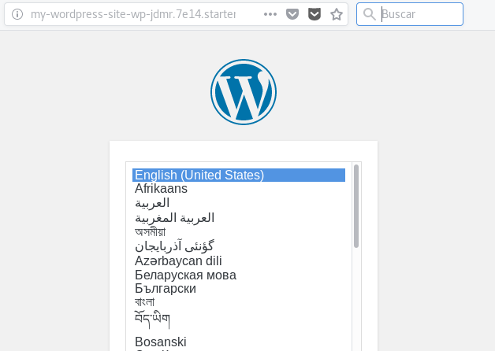

En la unidad anterior, hemos detallamos los pasos necesarios para crear una instancia de WordPress creando todos los recursos paso a paso en openShift. En esta última unidad, le mostraremos una forma mucho más fácil de instalar y ejecutar una nueva instancia de WordPress en OpenShift utilizando una plantilla y una imagen personalizada de WordPress.

Una plantilla describe un conjunto de objetos que se pueden parametrizar y procesar para desplegar de forma automática los recursos necesarios en OpenShift. en nuestro caso vamos a utilizar un *template* que de forma automática crea la aplicación WordPress, la aplicación mysql, los volúmenes necesarios para que la información sea persistente, ...

## Creación del template

El template que vamos a utilizar lo puedes encontrar en el repositorio GitHub: [https://github.com/openshift-evangelists/wordpress-quickstart](https://github.com/openshift-evangelists/wordpress-quickstart). Lo primero que tenemos que hacer es crear el recurso *template* en nuestro proyecto:

        $ oc create -f https://raw.githubusercontent.com/openshift-evangelists/wordpress-quickstart/master/templates/classic-standalone.json

A continuación si examinamos el catálogo de aplicaciones, veremos una nueva opción: **WordPress (Classic / Standalone)**. Si lo elegimos podremos indicar los parámetros de configuración de nuestras aplicaciones: mysql y wordpress:

Como podemos comprobar se han creado las dos aplicaciones:

Se han creado los dos volúmenes:

Y finalmente podemos acceder a nuestro wordpress accediendo a la ruta de la aplicación:

