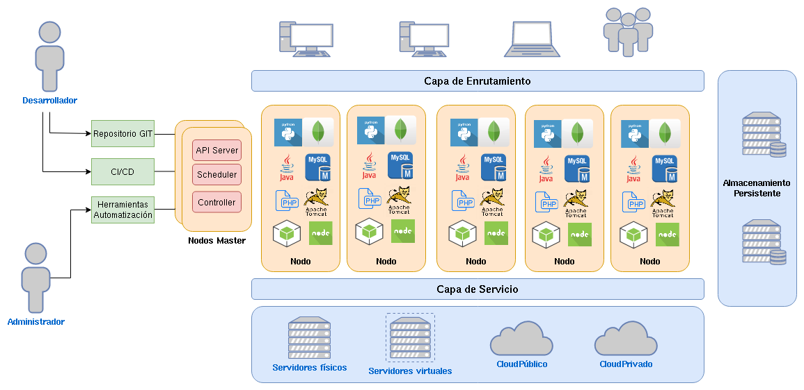

## ¿Qué es OpenShift v4?

* OpenShift v4 es una plataforma de contenedores de código abierto basada en Kubernetes que proporciona una solución completa de orquestación de contenedores y servicios de aplicaciones para desarrolladores y equipos de operaciones. 
* Es desarrollada por Red Hat y proporciona una forma eficiente y escalable de construir, implementar y gestionar aplicaciones en contenedores en entornos empresariales.
* Podemos decir que OpenShift v4 es una distribución de Kubernetes con muchas más funcionalidades: gestión de contenedores, como la creación de imágenes, el escalado de aplicaciones, el balanceo de carga, la monitorización de aplicaciones, la gestión de la red, la gestión de usuarios y roles, y la integración con sistemas de automatización y herramientas de DevOps.

## Ventajas del uso de OpenShift v4

* Por un lado nos ofrece las ventajas propias de una distribución de Kubernetes:
    * Desplegar aplicaciones de forma muy sencilla.
    * Tolerancia a fallos.
    * Escalalabilidad de las aplicaciones.
    * Actualizaciones automáticas de las aplicaciones.
    * Permite limitar los recursos a utilizar.
    * Enrutamiento a nuestras aplicaciones.
    * Uso de volúmenes para guardar la información.
    * ...
* Por otro lado, OpenShift v4 utiliza distintas herramientas que nos aportan otras muchas funcionalidades:
    * Es una plataforma para el desarrollo de aplicaciones, con características de Cloud Computing (PaaS).
    * Nos permite centrarnos en el desarrollo de la aplicación.
    * Esto se consigue con funcionalidades adicionales como la construcción automática de imágenes.
    * Permite la integración con herramienta de IC/DC, que nos facilita la gestión del ciclo de vida de la aplicación.
    * Nos permite de forma sencilla desplegar aplicaciones en distintos entornos: Desarrollo, Pruebas, Producción,...
    * Tenemos a nuestra disposición distintas herramientas de métrica y monitorización.
    * Despliegue sencillo de aplicación con el uso de Plantillas.
    * Tenemos varios mecanismos para interactuar con OpenShift: entorno web, cliente de línea de comandos o uso de la API.

## Arquitectura de OpenShift v4

