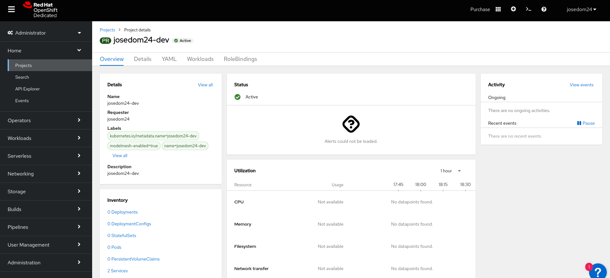

Un proyecto permite a OpenShift agrupar distintos recursos. Es similar al recurso **namespace** de Kubernetes, pero guarda información adicional.

De hecho, cada vez que se crea un nuevo proyecto, se crea un recursos **namespace** con el mismo nombre.

En **Red Hat OpenShift Dedicated Developer Sandbox**, no podemos crear nuevos proyectos y se nos asigna de forma automática un proyecto con el mismo nombre que el de nuestro usuario.

Para acceder a la información de nuestro proyecto, en la **Vista Administrator**, escogemos la opción **Home -> Projects**:

Si pulsamos sobre el nombre del proyecto, obtendremos los detalles del mismo: definición, inventario, uso de recursos, métricas, cuotas, eventos,...

Tenemos varias opciones:

* **Details**: Detalles de la definición del proyecto.
* **YAML**: Definición YAML del recurso proyecto.
* **Workloads**: Acceso a todos los recursos definidos en este proyecto.
* **RoleBindings**: Permisos definidos para este proyecto.