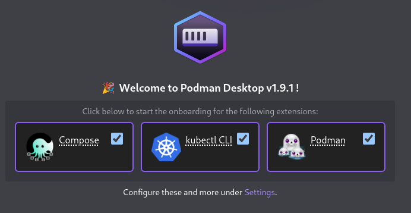

[Podman Desktop](https://podman-desktop.io/) es una herramienta gráfica de código abierto que le permite trabajar con contenedores y Kubernetes desde su entorno local.

## Funciones principales

* Trabajar con imágenes y contenedores rootless OCI.
* Construir imágenes OCI y gestionar los registros de imágenes.
* Trabajar con Pods.
* Trabajar con escenarios multicontenedor con Compose.
* Trabajar con Kubernetes, OpenShift,...
* Más funcionalidades añadiendo extensiones, por ejemplo trabajar con Docker.

## Instalación de Podman Desktop en Linux

Los requisitos para instalar Podman Desktop en Linux son los siguientes:

* Tener instalado Podman.
* Tener instalado [Flatpak](https://flatpak.org/setup/) (aplicación que nos permite instalar aplicaciones empaquetadas).

Nos aseguramos de tener el repositorio de Flatpak activo:

```
$ flatpak remote-add --if-not-exists --user flathub https://flathub.org/repo/flathub.flatpakrepo
```

Y realizamos la instalación:

```
$ flatpak install --user flathub io.podman_desktop.PodmanDesktop
```
Desde la [página de descargas](https://podman-desktop.io/downloads) nos podemos descargar el paquete flatpak o la aplicación comprimida en un tar. Y desde la [página de instalación en Linux](https://podman-desktop.io/docs/installation/linux-install) también nos muestran como realizar la instalación desde el terminal.


## Instalación de Podman Desktop en Windows/macOS

En la [página de instalación en Windows](https://podman-desktop.io/docs/installation/windows-install) encontramos los pasos que tenemos que realizar.

Partimos de que ya hemos instalado Podman en windows como estudiamos en el apartado [Instalación de Podman en Windows/macOS](contenido/modulo1/windows.md). Si no lo tuviéramos instalado, Podman Desktop crearía la máquina virtual necesaria y realizaría la instalación.

Descargamos el instalador de Windows desde la [página oficial](https://podman-desktop.io/downloads/windows) y realizamos la instalación.


Las instrucciones para la instalación en macOS la puedes encontrar en la [página de instalación en macOS](https://podman-desktop.io/docs/installation/macos-install).

## Instalación de las extensiones necesarias

Cuando iniciamos por primera vez Podman Desktop se ejecuta un asistente que instalará las extensiones más comunes que podemos utilizar:

* **Compose**: Las herramientas necesarias para trabajar con Compose desde Podman Desktop.
* **kubectl CLI**: Si vas a trabajar con Kubernetes desde Podman Desktop es necesario la instalación del cliente de Kubernetes `kubectl`.
* **Podman**: Si no has instalado previamente Podman se realizará la instalación.



## Dashboard de Podman Desktop


* Te indica el estado y la versión de Podman con la que estamos trabajando.
* **Learning Center**: Tenemos acceso a numerosos artículos donde nos enseñan a trabajar con distintos aspectos sobre los contenedores.

En el menú lateral encontramos las siguientes secciones:

* **Contenedores**: Nos permite la gestión de contenedores.
* **Pods**: Nos permite la gestión de Pods.
* **Imágenes**: Nos permite la gestión de Imágenes.
* **Volúmenes**: Nos permite la gestión de volúmenes.
* **Extensiones**: Nos permite gestionar las extensiones que podemos instalar en Podman Desktop.
* **Configuración**:
    * Recursos: Aplicaciones con las que podemos trabajar desde Podman Desktop.
    * Configuración del proxy.
    * Configuración de los registros de imágenes.
    * Clientes instalados.
    * Configuración de acceso a clúster de Kubernetes.
    * Gestión de extensiones.
    * Preferencias.
