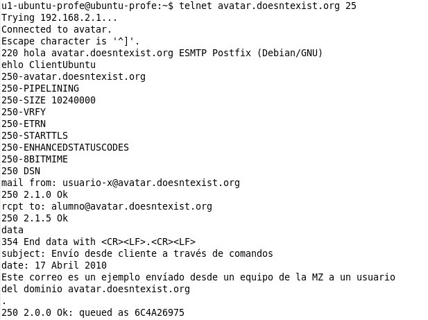
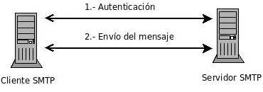
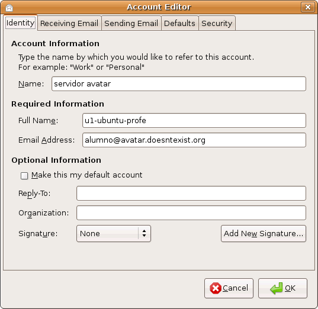
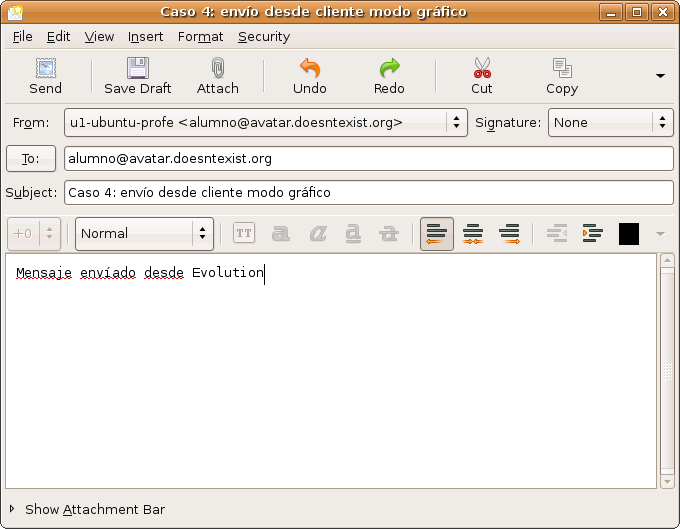
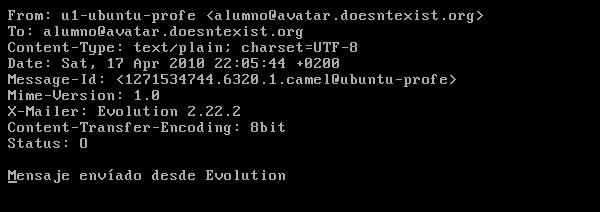

* Figura: a la figura anterior le añadimos 2 situaciones más, los casos 4 y 5.

* El objetivo de este apartado es la configuración en equipos cliente de nuestra red MZ para posibilitar el envío de correo entre usuarios de nuestro dominio.

## Caso 4: Envío de correo desde el cliente a usuarios del dominio avatar.doesntexist.org.

* Paso previo. Debemos habilitar el envío de correo desde cliente de nuestra red. Para ello añade 192.168.1.0/24 en la directiva `mynetworks`, quedando:

        mynetworks = 127.0.0.0/8 \[::ffff:127.0.0.0\]/104 \[::z1\] **192.168.1.0/24**

* Cliente: Usaremos como cliente, en primer lugar, una conexión telnet (poco vistosa y nada usada por los usuarios, pero muy interesante tanto para entender los pasos que sigue el protocolo SMTP (y otros) y para un administrador de redes).

    

* En la figura anterior observa los pasos del protocolo SMTP (ten en cuenta que estos pasos se siguen en cualquier de los 5 casos explicados, pero se introducen en este apartado al conectar en modo comando con telnet). Pasemos a describirlos.

* Esquema general:

    

* Fases en el envío de un mensaje de correo

    1. Fase de autenticación (puede haber otra si la sesión es cifrada). El cliente lanza los comandos siguientes para indicar qué usuario envía el correo, y a quién va dirigido. En nuestro ejemplo el cliente no llega a autenticarse al no estar configurado el servidor de correo para ello, tan sólo se intercambian estos mensajes.

        * EHLO o HELO “cadena presentándose el cliente ante el servidor”
        * MAIL FROM: “dirección de correo del remitente”
        * RCPT TO: “dirección de correo del destinatario”

        Una vez autenticado hay que componer el mensaje y enviar

    2. Fase de envío del mensaje.

        1. El cliente lanza la orden DATA y el servidor responde indicando `354 End data with <CR><LF>.<CR><LF>`, lo que quiere decir que cuando el cliente finalice el mensaje y desee enviarlo debe escribir un punto y dar un retorno de carro, es decir, una vez a la tecla intro.
        2. El cliente lanza las cadenas:

            1. From: “dirección del remitente” + SALTO DE LÍNEA (ie intro)
            2. To: “dirección del destinatario” + SALTO DE LÍNEA (ie intro)
            3. Cc: “dirección del destinatario” para tener una copia + SALTO DE LÍNEA (ie intro)
            4. Bcc: “dirección del destinatario” para tener una copia ciega
            5. Date: “fecha” + SALTO DE LÍNEA (ie intro)
            6. Subject: “asunto” + SALTO DE LÍNEA (ie intro)
            7. MIME-Versión: “valor de la versión de MIME usada” + SALTO DE LÍNEA (ie intro)
            8. Otras cabeceras + SALTO DE LÍNEA (ie intro)
            9. DOS SALTOS DE LÍNEAS
            10. Escribe el mensaje en varias líneas
            11. DOS SALTOS DE LÍNEAS, y en el segundo escribe “.” para finalizar el mensaje, y el cliente lo envía al servidor

* Servidor Avatar: lista de mensajes recibidos.

    

* Por último, usaremos un cliente gráfico, en nuestro caso Evolution. Evolution es el cliente gráfico clásico para el envío del correo -similar a las versiones Outlook de Microsoft y otras de Linux-.
    * Cliente. Lo primero que haremos será configurar una cuenta de correo
        * En nuestro programa Evolution accederemos a menú --> preferencias. Observése el uso intencionado de la interfaz en inglés como recurso para potenciar el programa de bilingúismo (el hábito hace al monje).
        * Añadiremos una cuenta cuya configuración será:

            

            

        * Componemos el mensaje y enviamos

            

        * Servidor Avatar: lista de mensajes recibidos.
            * Observamos como tenemos el mensaje anterior enviado desde línea de comandos y este último haciendo uso de Evolution. La siguiente figura muestra la parte final del buzón del usuario "alumno" (`/var/mail/alumno`).

                

## Caso 5: envío de correo a usuarios de otros servidores en Internet usando Avatar como servidor de correo local

* Este caso es idéntico al caso 3.
* ¿Piensas que tienes qué modificar la configuración de Postfix? Pues en principio no, puedes usar la configuración explicada anteriormente, añadiendo los dominios a los que quieres enviar correo con de la directiva `relay-domains`. Así si quieres enviar correo a un usuario del dominio `juntadeandalucia.es` debes indicarlo en esta directiva.
      
        relay-domains = juntadeandalucia.es

* Prueba a hacer envíos de correos a usuarios de otros dominios en Internet tanto en modo telnet como con Evolution.
* No olvides que puedes tener problemas de envío si tu IP es dinámica. Puedes comprobarlo en el fichero de log (`/var/log/alumno`). Solucionaremos este asunto en el siguiente apartado.