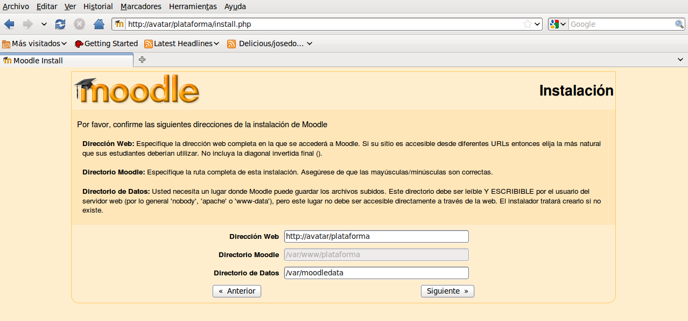
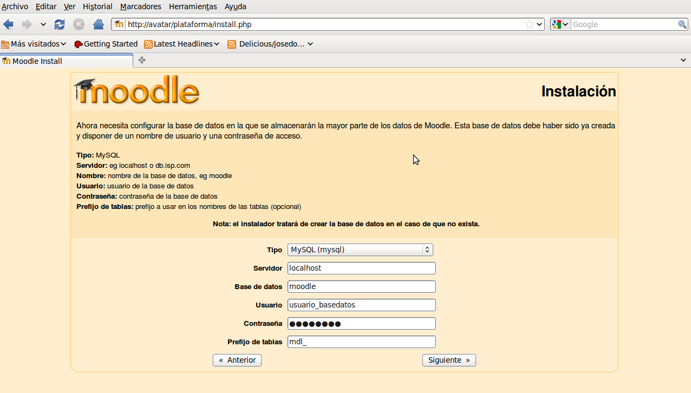
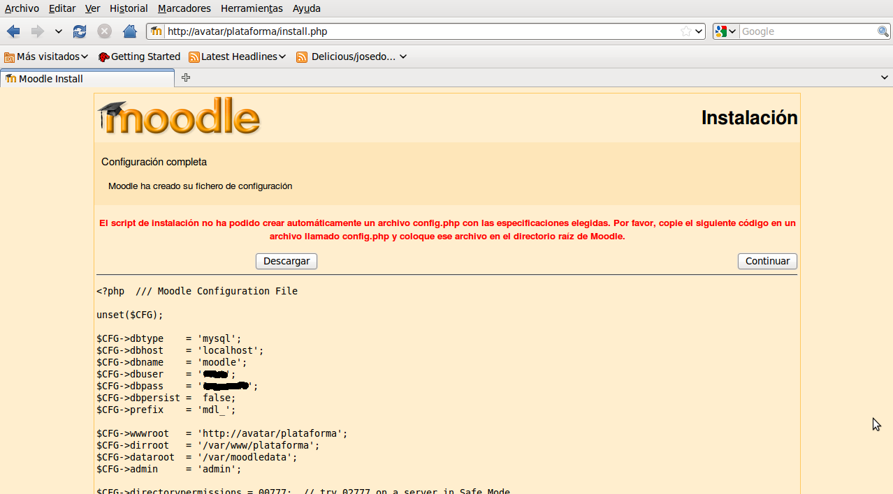
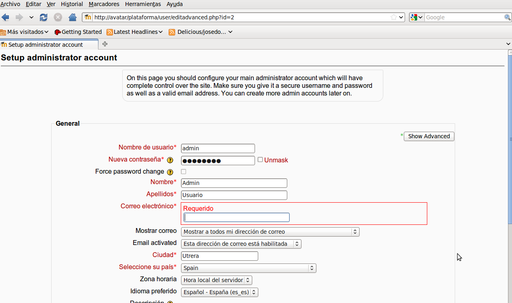
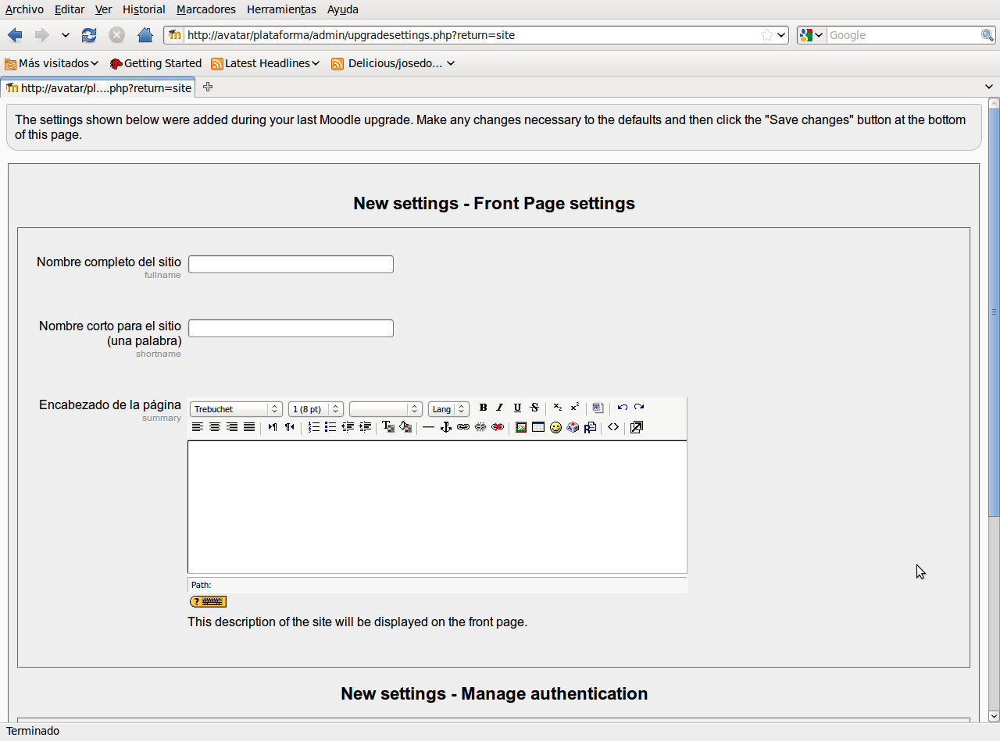

**Moodle** es un [Ambiente Educativo Virtual](http://es.wikipedia.org/wiki/Ambiente_Educativo_Virtual "Ambiente Educativo Virtual"), sistema de gestión de cursos, de [distribución libre](http://es.wikipedia.org/wiki/Software_libre "Software libre"), que ayuda a los educadores a crear comunidades de aprendizaje en línea. Este tipo de plataformas tecnológicas también se conoce como [LMS (Learning Management System)](http://es.wikipedia.org/wiki/LMS_%28Learning_Management_System%29 "LMS (Learning Management System)").  
  
La página oficial de moodle es [http://moodle.org/](http://moodle.org/)  
  
La última versión de moodle es la 1.9.7, y la página de descarga es: [http://download.moodle.org/](http://download.moodle.org) Podemos bajar el paquete comprimido en zip o en tar.gz desde la página o podemos utilizar el comando `wget`.  
  
1. Nos situamos en nuestro servidor avatar en el directorio /var/www y ejecutamos la siguiente instrucción:  

        avatar:/var/www# wget http://download.moodle.org/stable19/moodle-1.9.7.tgz

    A continuación descomprimimos el fichero comprimido:  

        avatar:/var/www# tar xzvf moodle-1.9.7.tgz

    Ya podemos borrar el fichero comprimido. Además ahora es la hora de elegir el nombre del directorio donde vamos a tener nuestra plataforma, una sugerencia es renombrar la carpeta moodle a plataforma, de esta forma para acceder al moodle desde el cliente tenderemos que acceder a `http://avatar/plataforma`:  

        avatar:/var/www# rm moodle-1.9.7.tgz
        avatar:/var/www# mv moodle plataforma

2. Antes de comenzar la instalación vamos a crear una base de datos y un usuario en el servidor mysql que será el propietario de la base de datos anteriormente creada. Para ello accedemos al servidor mysql, se nos pedirá una contraseña que es la del root que indicamos durante su instalación.  

        avatar:/var/www# mysql -u root -p
        > CREATE DATABASE moodle DEFAULT CHARACTER SET utf8 COLLATE utf8_unicode_ci; > GRANT SELECT,INSERT,UPDATE,DELETE,CREATE,DROP,INDEX,ALTER ON moodle.* TO moodleuser@localhost IDENTIFIED BY 'yourpassword';
        > quit
        avatar:/var/www# mysqladmin -p reload 

    El último comando recarga los permisos de los usuarios. En el ejemplo anterior hemos creado la base de datos moodle y un usuario llamado `moodleuser` con la contraseña `yourpassword` (que obviamente deberás cambiar).  
  
3. Para comenzar la instalación lo único que tenemos que hacer es acceder a la web desde el cliente a la dirección `http://avatar/plataforma`  
  
    * En primer lugar elegimos el idioma  
  
      
  
    * A continuación se hace una comprobación de los ajuste de PHP. Seguramente te faltará algún paquete, averigua cual e instálalo y si no es así utiliza el foro para comentar que puntos no se cumplen.  
  
      
  
    * En la siguiente pantalla tenemos que indicar dos datos importantes:  

        * Dirección Web: Especifique la dirección web completa en la que se accederá a Moodle.
        * Directorio de Datos: Es necesario un lugar donde Moodle pueda guardar los archivos subidos. Este directorio debe ser leíble Y escribible por el usuario del servidor web, pero este lugar no debe ser accesible directamente a través de la web.

      
  
    Los datos que nos ponen por defecto son adecuados, pero debemos crear el directorio `moodledata`, darles permisos de lectura y escritura para el usuario del servidor web `www-data`:  

        avatar:/# mkdir /var/moodledata
        avatar:/# chown www-data:www-data /var/moodledata
        avatar:/# chmod 777 -R /var/moodledata

    * En la siguiente pantalla indicamos los datos de la base de datos:  

        * **Tipo:** MySQL
        * **Servidor:** en nuestro caso localhost
        * **Nombre:** nombre de la base de datos, en nuestro caso moodle
        * **Usuario:** usuario de la base de datos
        * **Contraseña:** contraseña de la base de datos
        * **Prefijo de tablas:** prefijo a usar en los nombres de las tablas (opcional)

      
  
    * A continuación se hace una comprobación del servidor: se nos pide que instalemos algunas extensiones de PHP, pero ninguna son obligatorias. Continuamos adelante.  
  
      
  
    * A continuación descargamos el paquete de idioma español. Pulsamos el botón de Descarga.  
  
      
  
    * Estamos terminando: Ya tenemos toda la configuración preparada, en la siguiente pantalla nos aparece el contenido del fichero de configuración. Copiamos el contenido y lo pegamos en el fichero `/var/www/plataforma/config.php` (este fichero lo tienes que crear).  
  
      
  
    * Se va a comenzar la instalación propiamente dicha. Donde se van a ir creando las tablas necesarias en la base de datos. Puede elegir la opción Unattended operation y no será necesario que hagas nada más hasta la siguiente pantalla.  
  
    * Configuración de la cuenta del administrador: Debes indicar nombre de usuario administrador, contraseña, nombre y apellido, correo electrónico, provincia y país.  
  
      
  
    * Configuración del sitio: Debes indicar el nombre de la página, el nombre corto y una descripción.  
  
      
  
    * Y hemos terminado la instalación, puedes encontrar manuales sobre moodle en los siguientes enlaces:  

        * [Moodle para Profesores](http://www.josedomingo.org/web/course/view.php?id=9)
        * [Moodle para Estudiantes](http://www.josedomingo.org/web/course/view.php?id=8)
        * [Características de Moodle](http://www.josedomingo.org/web/course/view.php?id=10)